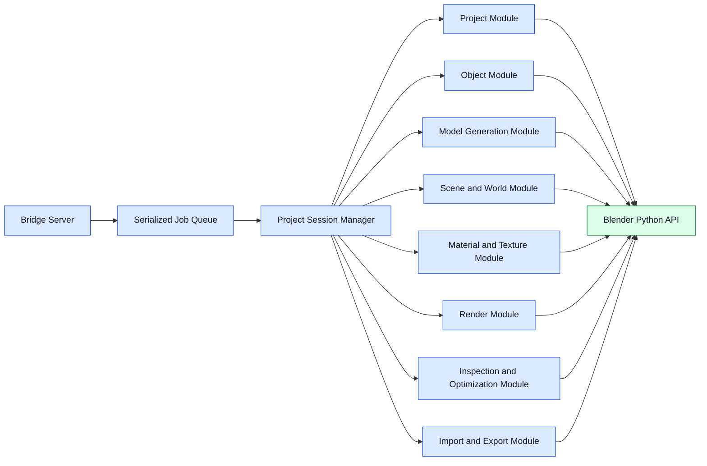

# Blender Controller Components

## Component Diagram

## Responsibilities

- Bridge Server: authenticate local RPC, parse requests, emit progress, and return structured results
- Serialized Job Queue: ensure Blender mutations execute in a predictable sequence per runtime
- Project Session Manager: open, save, snapshot hooks, active project lifecycle, and scene context tracking
- Domain Modules: encapsulate modeling, materials, lighting, render, QA, and export operations as reusable functions

## Execution Rules

- All mutating bpy work executes through one serialized job queue per Blender runtime.
- Long-running tasks periodically emit progress and heartbeat events.
- Controller responses include created, modified, and deleted object references whenever practical.
- Domain modules must remain pure at the planning level and Blender-specific only at the final execution layer.