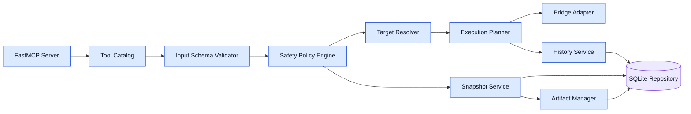

# MCP Server Components

## Component Diagram

## Responsibilities

- FastMCP Server: protocol lifecycle, tool exposure, progress forwarding, and transport handling
- Tool Catalog: tool descriptions, input schemas, output schemas, titles, and capability discovery
- Input Schema Validator: request-shape validation and normalization
- Safety Policy Engine: directory checks, budget checks, destructive-operation gates, and format allowlists
- Target Resolver: object, part, collection, and region resolution
- Execution Planner: converts validated tool intent into controller commands and pre/post hooks
- Bridge Adapter: local RPC to Blender controller with correlation IDs, retries, and heartbeat checks
- History Service: operation records, warnings, errors, and result summaries
- Snapshot Service: policy-driven capture and restoration support
- Artifact Manager: canonical path generation for renders, exports, and snapshot payloads

## Failure Modes and Handling

- Validation failure: reject request before Blender call
- Policy violation: reject request with structured error and remediation
- Bridge timeout: mark operation partial or failed, preserve request record, and attempt controller health probe
- Blender execution error: capture traceback, map to structured tool error, and preserve rollback path if available