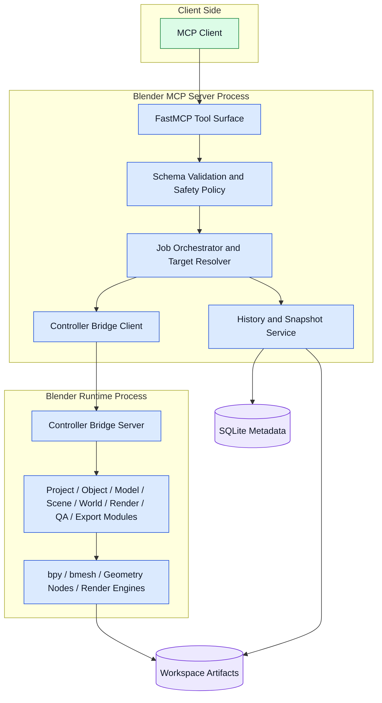

# Container Diagram

## Container View

## Description

The server process is responsible for all protocol-facing behavior and policy decisions. The Blender process is responsible for all scene-stateful work. SQLite stores structured metadata, while the filesystem stores artifacts and snapshot payloads.