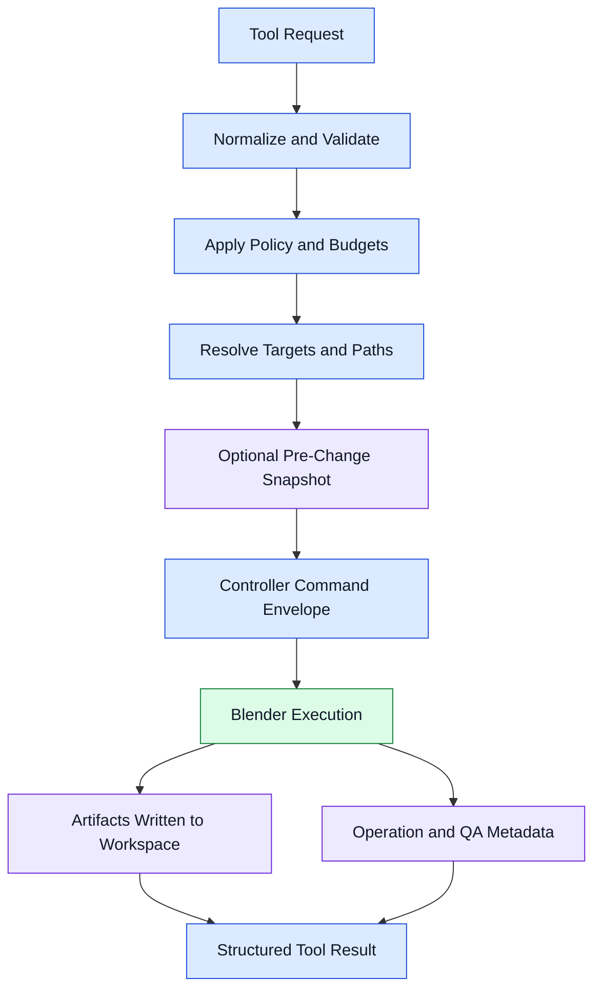

# Data Flow

## Main Data Flow

## Data Classes

- Request data: request_id, tool_name, user instruction, structured parameters, target identifiers, policy mode
- Execution data: resolved controller command, runtime session id, progress events, controller warnings
- Artifact data: blend files, preview images, final renders, exports, logs, snapshot payloads
- Metadata data: project rows, operation logs, QA findings, snapshot indices, export records

## Data Integrity Rules

- Artifact paths are generated centrally by the server, never from raw model input alone.
- History is written even for partial failures.
- Snapshot metadata is committed before destructive controller commands run.
- Tool results always include both human-readable summary and machine-readable changed-object data.