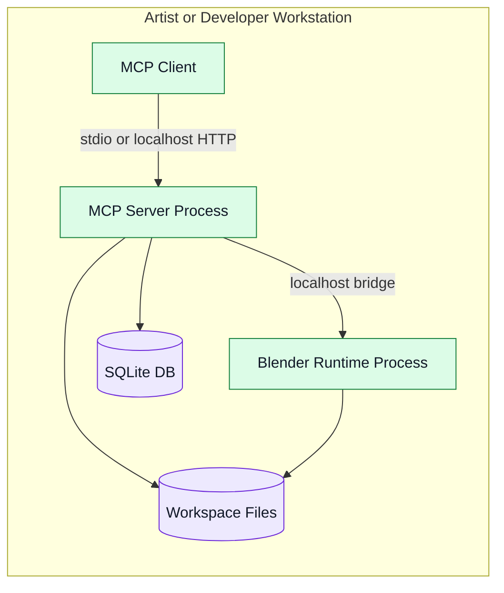
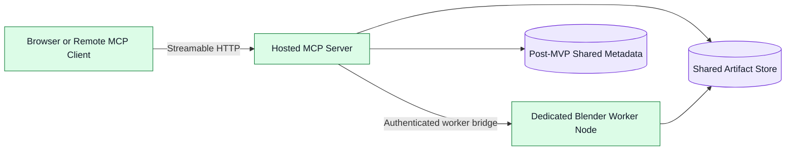

# Deployment Diagram

## Primary Local Deployment

## Optional Hosted Deployment

## Description

The primary architecture is local-first. A future hosted mode is possible, but it is not the first deployment target and would likely replace SQLite with a client/server metadata store.