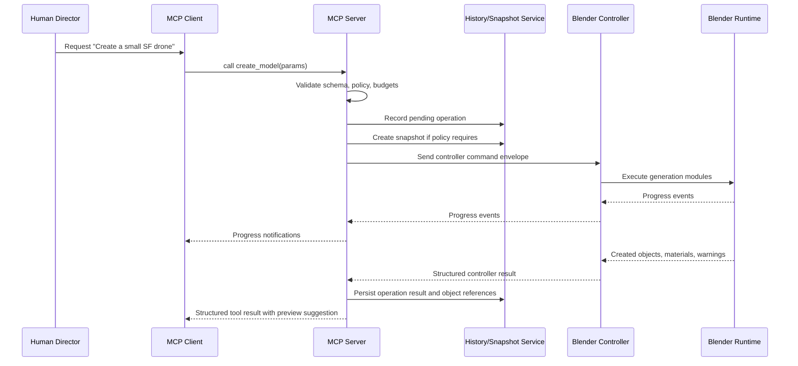

# Sequence Diagram: Create Model

## Description

The server owns validation, policy, and history. Blender owns geometry creation. Progress is emitted back to the client without exposing Blender internals directly.