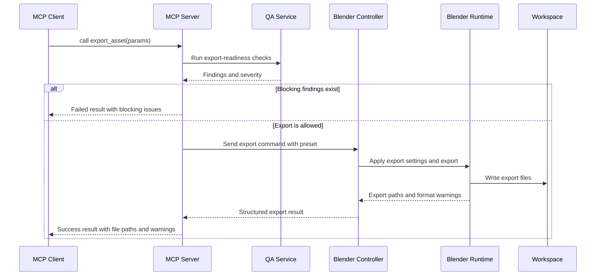

# Sequence Diagram: Export Asset

## Description

Export is gated by target-format validation. The system returns warnings for lossy or partially supported mappings instead of pretending all Blender features survive every format.