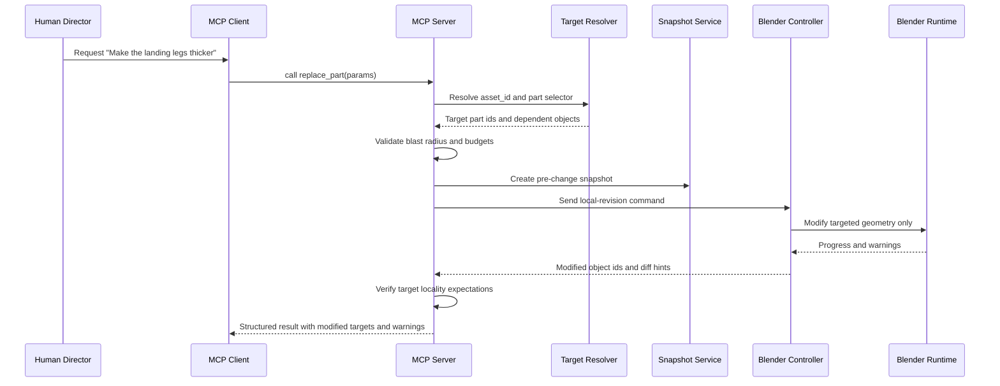

# Sequence Diagram: Revise Asset Part

```mermaid
sequenceDiagram
    participant U as Human Director
    participant C as MCP Client
    participant S as MCP Server
    participant T as Target Resolver
    participant H as Snapshot Service
    participant B as Blender Controller
    participant R as Blender Runtime

    U->>C: Request "Make the landing legs thicker"
    C->>S: call replace_part(params)
    S->>T: Resolve asset_id and part selector
    T-->>S: Target part ids and dependent objects
    S->>S: Validate blast radius and budgets
    S->>H: Create pre-change snapshot
    S->>B: Send local-revision command
    B->>R: Modify targeted geometry only
    R-->>B: Progress and warnings
    B-->>S: Modified object ids and diff hints
    S->>S: Verify target locality expectations
    S-->>C: Structured result with modified targets and warnings
```

## Description

Local revision is a first-class workflow. The server resolves and constrains targets before Blender mutates anything.