# System Context

## Context Diagram

```mermaid
flowchart LR
    classDef person fill:#fef3c7,stroke:#92400e,color:#111827
    classDef system fill:#dbeafe,stroke:#1d4ed8,color:#111827
    classDef external fill:#dcfce7,stroke:#15803d,color:#111827
    classDef storage fill:#ede9fe,stroke:#6d28d9,color:#111827

    User[Human Director User]:::person
    Client[MCP Client\nChatGPT Business / Copilot / VS Code / Cursor / Claude Desktop]:::external
    MCP[Blender MCP Server]:::system
    BlenderCtrl[Blender Controller Bridge]:::system
    Blender[Blender Runtime]:::external
    Workspace[Workspace Artifacts\n.blend / renders / exports / snapshots / logs]:::storage
    Metadata[SQLite Metadata Store]:::storage

    User -->|Natural-language direction and review| Client
    Client -->|MCP tool calls| MCP
    MCP -->|Validated local RPC| BlenderCtrl
    BlenderCtrl -->|Blender Python API commands| Blender
    Blender -->|Generated assets, previews, exports| Workspace
    MCP -->|Operation logs, snapshots, QA metadata| Metadata
    MCP -->|Structured tool results| Client
    Workspace -->|Artifacts for review| Client
```

## Description

The user never operates Blender directly through this system boundary. The user communicates intent to an MCP client. The client invokes MCP tools on the Blender MCP Server. The server validates the request, resolves targets, checks policy, and forwards execution to the Blender controller. Blender performs modeling, rendering, inspection, and export work. Artifacts are written to the workspace, while metadata and history are persisted in SQLite.