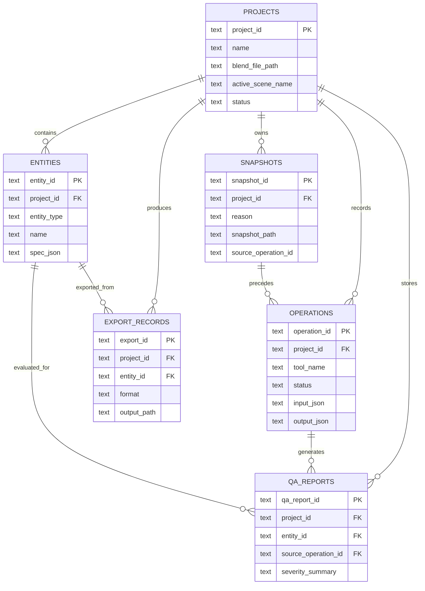

# Conceptual Data Model

## Description

The schema separates project ownership, entity metadata, operation history, reversible snapshots, QA outputs, and export records. This keeps geometry in files while still making revision history queryable.